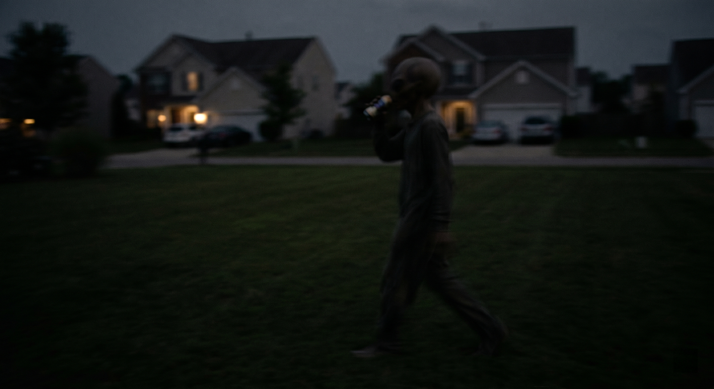
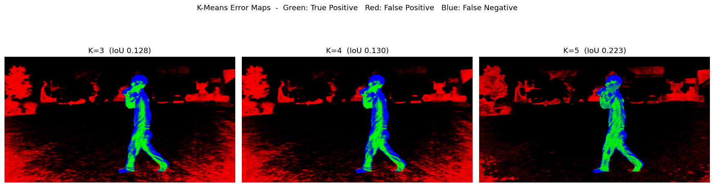
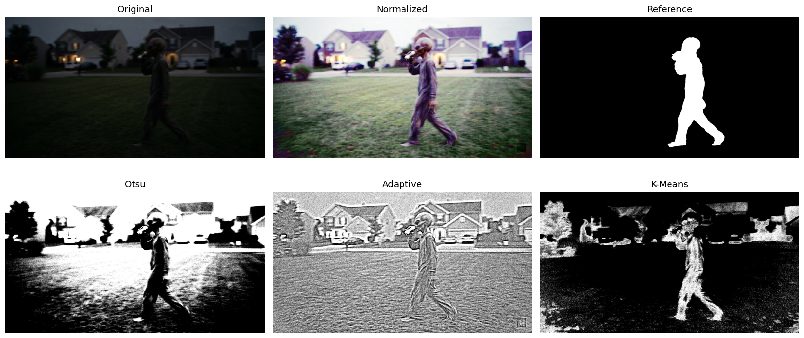
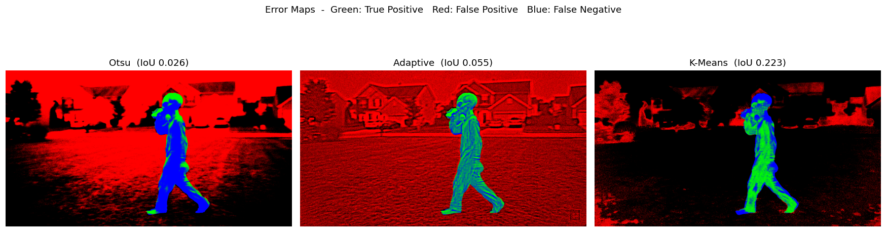
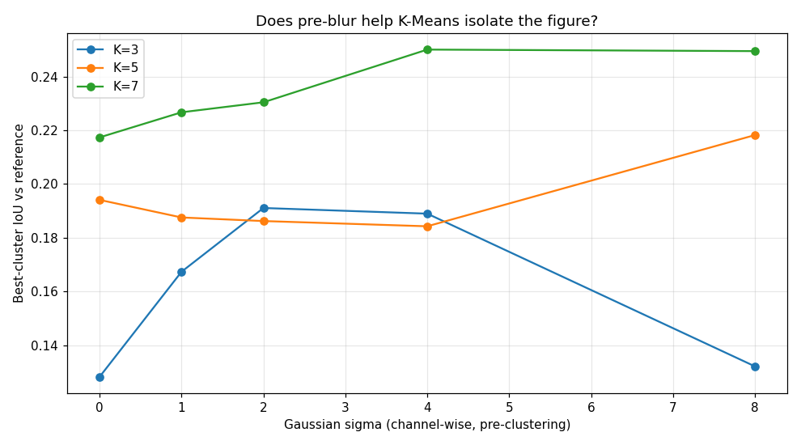
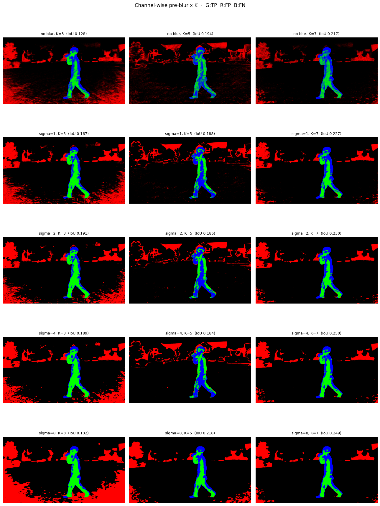

# HW2: CS 898BA – Image Analysis and Computer Vision

Andrew Lisenby, B.S.

Wichita State University

## Assignment

**Purpose:** To apply and evaluate classical and optimization-based image segmentation techniques.

**Situation:** Your supervisor’s supervisor is back. After reviewing your edge detection plots from Homework One, he is convinced that the "alien" has a distinct torso and head structure. He wants you to isolate the entity from the background completely and mutters something about "extracting the exact pixel area for a bio-mass calculation" before rushing out to a meeting.

Since you already have a repository and a solid pipeline, you decide to waste more time by using image segmentation to isolate the figure.



## Description

This repository contains the required files for CS 898 - Image Analysis and Computer Vision (Wichita State University), including an AI_Log file to track AI usage (which I am deliberately avoiding). Homework Two builds on the Homework One pipeline, adding image segmentation: multi-channel normalization, threshold and clustering based segmentation, and evaluation against a pseudo-ground-truth reference mask.

## Setup & Installation:
**Linux instructions:**
```
cd <RepoDir>
python3 -m venv .venv
source .venv/bin/activate
pip3 install -r requirements.txt
```

**Windows Instructions:**

[Follow this tutorial and then see above instructions.](https://ubuntu.com/tutorials/install-ubuntu-desktop#1-overview)

## Usage and Execution:

**Running the full pipeline:**
```
# Runs Parts 2-5 in order; use --skip to skip the pause between steps.
bash ./run_full_pipeline.sh

# Or run parts individually from the project root:
python3 part02/normalization.py
```

## Results and Discussion:

> For a full set of generated images, run `run_full_pipeline.sh`. The full set was omitted to avoid bloating the repo.

### Part 2: Multi-Channel Normalization

Histogram equalization is applied independently to each BGR channel, then the channels are merged back into a normalized color image that serves as the input for every subsequent step. Equalization spreads each channel across the full intensity range, pulling the very dark original means toward the center:

| Channel | Original Mean | Normalized Mean |
| --- | --- | --- |
| Blue | 21.8 | 127.2 |
| Green | 24.6 | 130.3 |
| Red | 20.6 | 127.9 |

### Part 3: Threshold-Based Segmentation

Both methods operate on the grayscale of the normalized image. Otsu selected a global threshold of 129; adaptive thresholding uses a Gaussian-weighted local mean (block size of 51, C=5). Each method saves a binary mask and a color foreground extraction.

### Part 4: K-Means Color Clustering

K-Means is run in HSV space for K = 3, 4, 5. For each K, every cluster's binary mask is scored against the hand-drawn reference, and the best-matching cluster is kept. The optimal K is the one whose best cluster most closely captures the figure:

| K | Best Cluster | IoU |
| --- | --- | --- |
| 3 | #2 | 0.128 |
| 4 | #1 | 0.130 |
| **5** | **#3** | **0.223** |

**Chosen K=5.**

**Error maps** — best-overlap cluster of each K (green = true positive, red = false positive, blue = false negative):



The cluster value that achieved both the best ground truth coverage, and minimum error, was K=5. Further testing suggested that K=7 would have performed even better, but increasing it beyond 7 reduced the IoU and decreased the overall size due to capturing less diverse clusters.

### Part 5: Evaluation and Analysis

Each segmentation is scored against the hand-drawn reference mask using IoU (Jaccard index) and the Dice coefficient:

| Method | IoU | Dice |
| --- | --- | --- |
| Otsu | 0.026 | 0.051 |
| Adaptive | 0.055 | 0.104 |
| **K-Means (K=5)** | **0.223** | **0.364** |

**Comparison plot** — original, normalized, reference, and the three segmentation masks:



**Error maps** — per-method IoU breakdown (green = true positive, red = false positive, blue = false negative):



As you can see from the red (fp) pixels alone, K-means is the clear winner. Adaptive focused on local intensities and performed poorly, particularly in the textured areas, like the grass. This is presumably because the local Gaussian distribution fires more aggressively in noisy regions. Otsu was a the worst, a single global threshold simply cannot adequately capture the contrastive qualities of this photo, instead it captured the Vignette-like lighting well, focusing primarily on the highest intensity regions, like the sky and houses.

## Additional Findings (Exploratory)

> These experiments go beyond the assignment scope (which capped K at 5). They are included as personal investigation into the K-Means failure modes and are not part of the graded pipeline.

### Channel-Wise Pre-Blur Before Clustering

Histogram equalization maximizes contrast but also amplifies per-pixel noise, which scatters the figure's body across neighboring clusters. Applying a channel-wise Gaussian blur (kernel sized by the 3-sigma rule, `2⌈3σ⌉+1`) to the normalized image before clustering denoises each channel and makes the figure more color-homogeneous. Sweeping sigma against K = 3, 5, 7 and scoring the best-overlap cluster against the reference mask:

| σ \ K | K=3 | K=5 | K=7 |
| --- | --- | --- | --- |
| none | 0.128 | 0.194 | 0.217 |
| 1.0 | 0.167 | 0.188 | 0.227 |
| 2.0 | 0.191 | 0.186 | 0.230 |
| 4.0 | 0.189 | 0.184 | **0.250** |
| 8.0 | 0.132 | 0.218 | 0.249 |





Like above, K=7 had the greatest result, but the best result per cluster scaled almost uniformly with sigma. This suggests that noise in the image is actively destructive to clustering performance, and smoothing the texture/noise features reduces outliers that cannot be sufficiently captured.