# HW1: CS 898BA – Image Analysis and Computer Vision

Andrew Lisenby, B.S.

Wichita State University

## Assignment

Purpose: To apply basic image analysis and processing techniques.

Situation: You are working at Meta, and your supervisor’s supervisor walks in, gasping for air. You don’t often interact with him, so this visit is strange. He opens a folder on his personal computer and shows you an image he thinks is an alien, captured by his doorbell camera. You are not convinced and think he is just seeing things. He came to see you because he heard you took an image analysis course in college and wants you to clean up the image so it is easier to make out what is in it.


## Description

This repository contains the required files for CS 898 - Image Analysis and Computer Vision (Wichita State University), including an AI_Log file to track AI usage (which I am deliberately avoiding), multi-step image processing output and scripts, and a fun hello_world animation just to add something more pragmatic to the repository.

## Setup & Installation:
**Linux instructions:**
```
cd <RepoDir>
python3 -m venv .venv
source .venv/bin/activate
pip3 install -r requirements.txt
```

**Windows Instructions:**

[Follow this tutorial and then see above instructions.](https://ubuntu.com/tutorials/install-ubuntu-desktop#1-overview)

## Usage and Execution:
**Running hello_world.py:**

```
cd <RepoDir>/part01
python3 hello_world.py
```

**Running full pipeline:**
```
# Full pipeline execution (time consuming)
# Use --skip to skip confirmation between steps
bash ./run_full_pipeline.sh

# Run isolated by calling python files individually from project root.
# For example:
python3 part02/basic_statistics.py
```

## Results and Discussion:

### Part 2:

**Image Metadata**

| Statistic | Value |
| --- | --- |
| Image Shape: | (1536, 2816, 3) |
| Data Type: | uint8 |
| Number of Channels: | 3 |
| Total Pixels: | 12976128 |


**Channel Statistics**

| Statistic | Blue Value | Green Value | Red Value |
| --- | --- | --- | --- |
|Min:|0|0|0|
|Max:|255|255|255|
|Mean:|21.83|24.64|20.61|
|Median:|10.00|16.00|12.00|
|Mode:|4|10|4|
|Range:|255|255|255|
|Std Dev:|26.23|22.23|22.46|
|Variance:|687.99|493.96|504.26|
|Skew:|1.68|1.76|2.11|

From the statistics, we can see that the image is about 13MP, and the channel with the greatest variance is blue. The mean values all sit in the low 20s which is very low in the total range, despite the full uint8 range being used. That suggests to me that the image is dark as a result of being underexposed.

**NOTE:** The full set of generated images are not packaged with this repo to preserve space; they can easily be generated in about 3 minutes with the run_full_pipeline.sh script.

**Gaussian Blur:**

For this step I manually implemented Gaussian Blur for my understanding. I implemented it as a separable 2-pass 1D kernel. This reduces compute per kernel to O(2k) vs single pass 2D kernel compute of O(k^2).

The kernel size was originally hard coded to 5, after starting to write this discussion I noticed that the sigma value was not exhibiting the trait I was expecting. The kernel size was subsequently dynamized to the 3-sigma rule 2⌈3σ⌉+1 and regenerated.

Sigma was set to 0.5, 1.0, 1.5, 2.0, 2.5, 3.0, 3.5. These values of sigma and the kernel effect the edge preservation and span of the blur. Lower sigma values allowed distant neighboring values in the kernel to have a more profound effect on the relevant pixel (lower weight decay).

**Example:**

| Settings | Image |
| --- | --- |
| Normalized Blur Sigma 0.5 Kernel 5 |  |
| Normalized Blur Sigma 3.5 Kernel 5 |  |
| Normalized Blur Sigma 3.5 Kernel 23 | 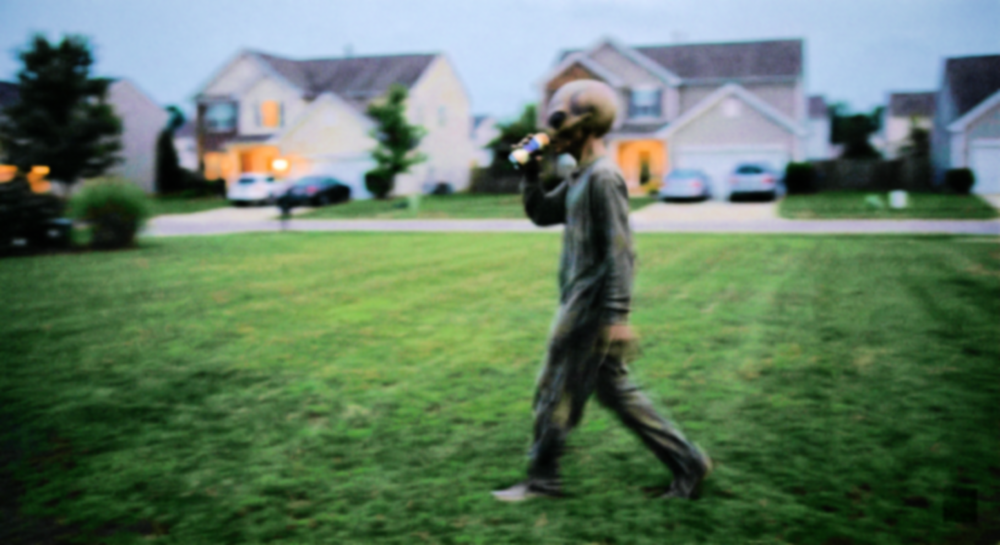 |

| Normalized Blur Sigma 0.5 Kernel 5 Zoomed | Normalized Blur Sigma 3.5 Kernel 5 Zoomed | Normalized Blur Sigma 3.5 Kernel 23 Zoomed |
| --- | --- | --- |
| 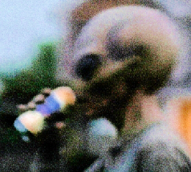 | 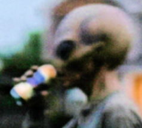 |  |

Notice the reduction in noise between Sigma 3.5 K5 and K23. The image is much smoother, despite not losing significant edge definition. I will illustrate the kernel size relevance further during edge detection.

### Part 3: 

Without any semblance of a doubt Canny was NOT the edge detection that was appropriate for this image. I tuned Canny per-image after an initial run with static values, and it still performed poorly with nearly all of the generated images. The best class of image were the normalized and blurred images since it works by thresholding intensities.

The results between sobel and prewitt tracked one another so closely it is hard to name a clear winner; both performed very well on the high sigma normalized images the best when values were higher.

Laplacian also seemed to do best with the normalized high sigma images, but didn't generate coherent edges on most other color spaces.

| Settings | Image |
| --- | --- |
| Normalized Blur Sigma 0.5 Kernel 5 | 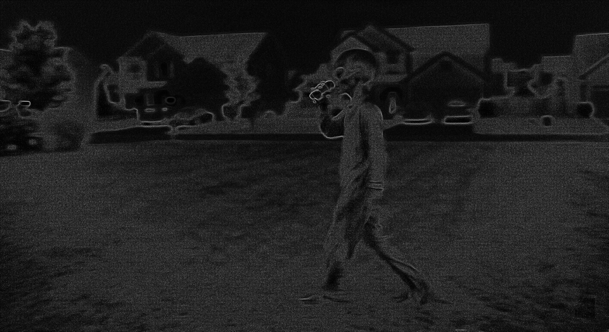 |
| Normalized Blur Sigma 3.5 Kernel 5 | 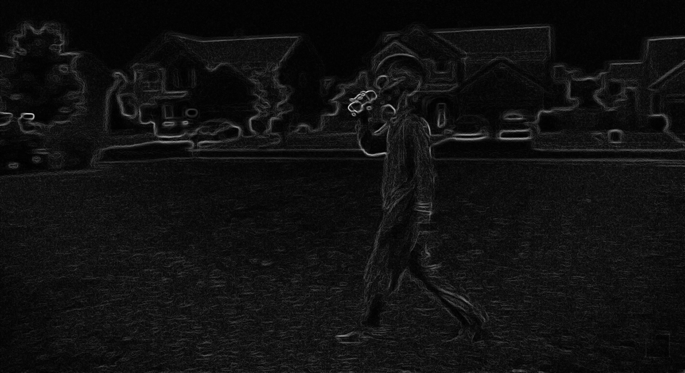 |
| Normalized Blur Sigma 3.5 Kernel 23 | 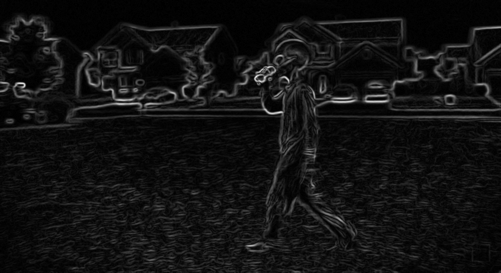 |

Above is the previously discussed performance comparison of various kernel size/sigma combinations. Higher sigma values performed better than lower, presumably due to its ability to filter noise while preserving edge features. Appropriately sizing the kernel amplified this result by filtering over a larger area, leading to an overall smoother surface texture.

|hls_blur_s1.5|
| --- |
|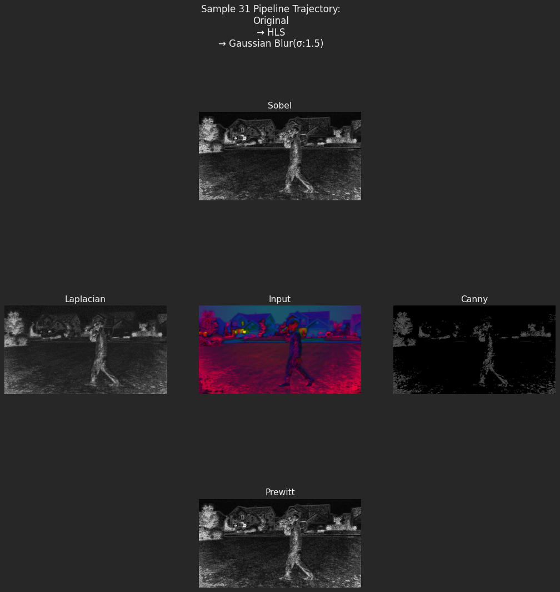|

|hsv_blur_s2.5|
| --- |
|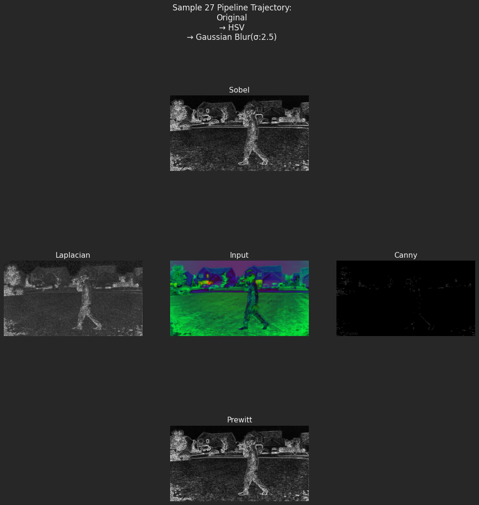|

|hsv_scale_0.8_blur_s2.5|
| --- |
|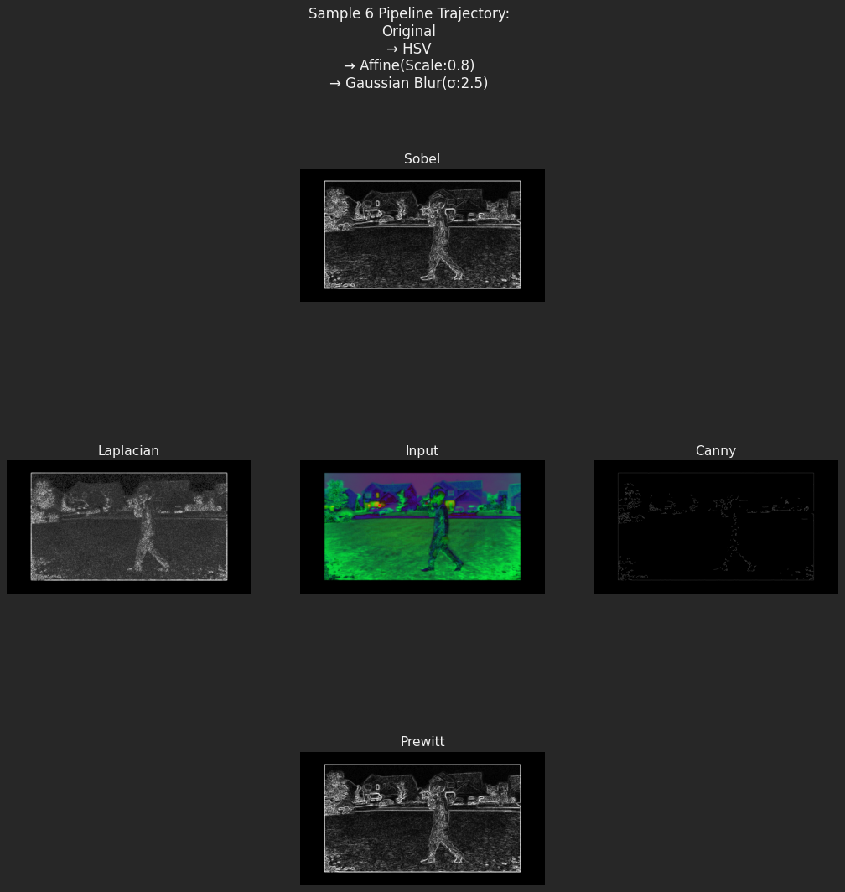|

|hsv_shear_x_0.10_blur_s2.0|
| --- |
|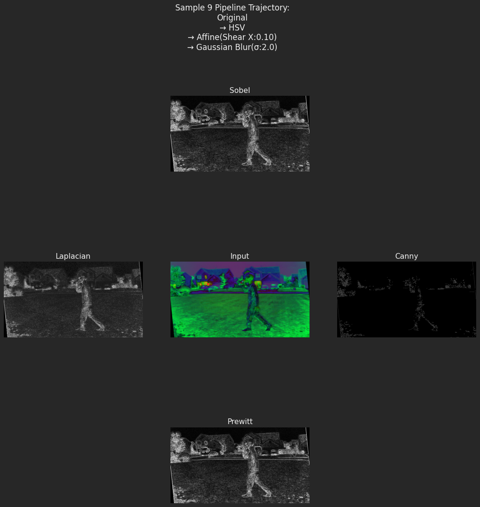|

|lab_translate_150_neg100_blur_s1.0|
| --- |
|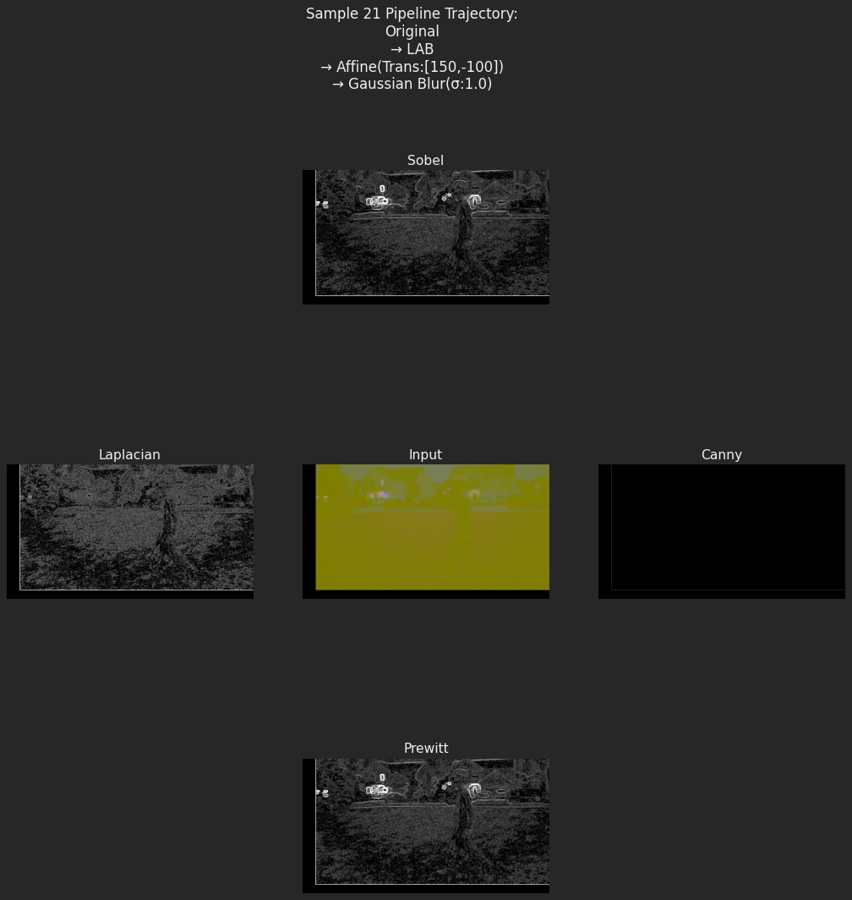|

|normalized_translate_neg100_neg80|
| --- |
|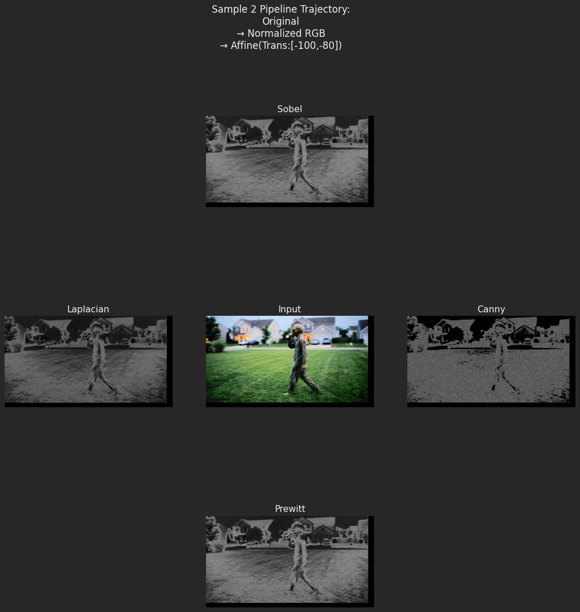|

## TODO:
- [x] Add project title, author, course
- [x] Include brief project overview and "alien image" context
- [x] Add **Setup & Installation** section
- [x] Add **Usage/Execution** section
- [x] **Results - Part 2**:
  - [x] Image statistics table for original channels
  - [x] ~~Show/save examples of greyscale/binary/color spaces + normalized RGB~~ Not Required To Show
  - [x] ~~Affine transformations summary + sample images~~ Not Required To Show
  - [x] Gaussian blur discussion + examples for different sigma values
- [x] **Results - Part 3**:
  - [x] Edge detection analysis (pros/cons + which worked best)
  - [x] Embed 6 random 5-image comparison plots
  - [x] Summary of total images generated
- [x] Link to `AI_Log.md` and key AI-assisted parts
- [x] ~~Add **Discussion/Conclusions** (key learnings, challenges, observations)~~ Not required and covered in results
- [x] ~~Include table of contents for navigation~~ Not Required
- [x] ~~Add badges (Python, OpenCV) and license if applicable~~ Not Required
- [ ] Clean up. ~~: remove full assignment text or move to separate file; keep only relevant summary~~
- [ ] Ensure all images/plots are linked properly and render in GitHub
- [x] Create run_full_pipeline.sh
- [x] ~~Refactor decision_making method to reduce time complexity of future assignments [AWT downtime]~~ Moved to feature requests.
- [x] Make more coffee