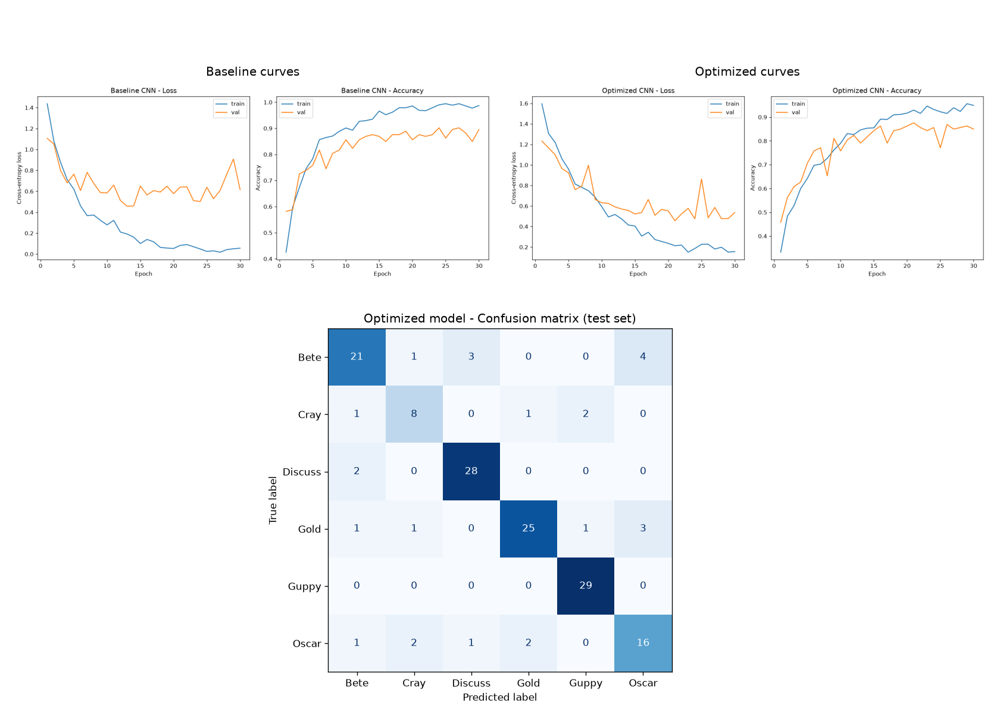
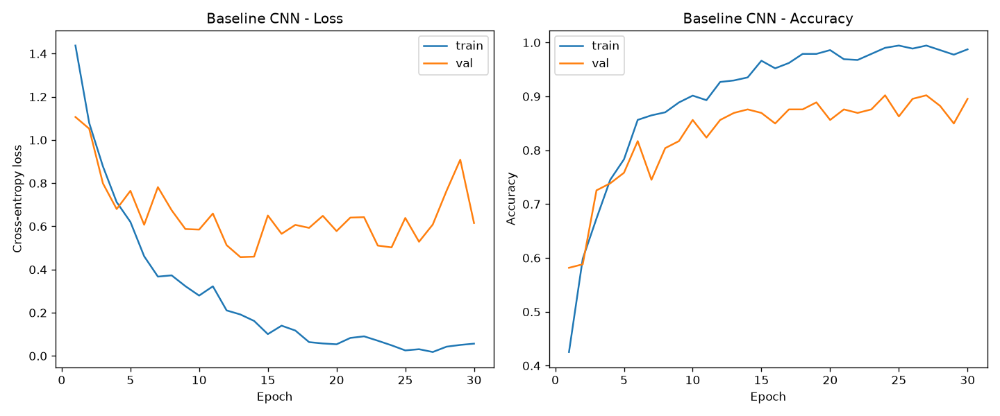
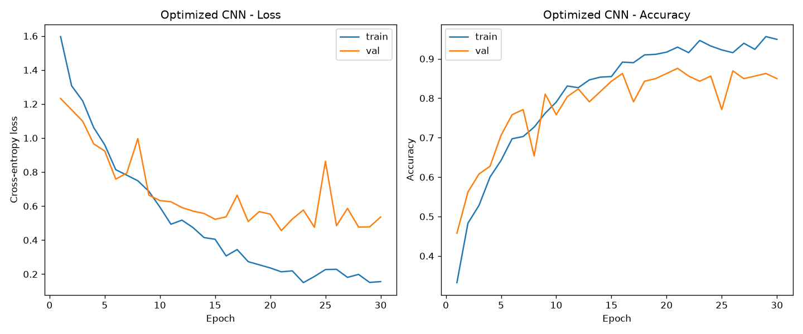

# HW3: CS 898BA – Image Analysis and Computer Vision

Andrew Lisenby, B.S.

Wichita State University

## Assignment

**Purpose:** To design, train, and evaluate a convolutional neural network (CNN) from scratch for a multi-class image classification task, then improve it through hyperparameter tuning.

**Task:** Classify aquarium fish images into six species (Betta, Crayfish, Discus, Goldfish, Guppy, Oscar) using a custom CNN built in PyTorch. Establish a baseline model, tune it via grid search, and analyze the results.



## Description

This repository contains the required files for CS 898 - Image Analysis and Computer Vision (Wichita State University), including an AI_Log file to track AI usage (which I am deliberately avoiding). Homework 3 deviates from the Homework 1-2 pipelines and only reused basic utils for pretty-print functionality.

## Setup & Installation

**Linux instructions:**
```
cd <RepoDir>
python3 -m venv .venv
source .venv/bin/activate
pip3 install -r requirements.txt
```

## Usage and Execution

**Running the full pipeline** (sets up the venv, extracts the dataset, and runs Parts 2–5):
```
bash ./run_full_pipeline.sh
```

**Running parts individually** from the project root:
```
python3 part02/data.py      # data split summary
python3 part03/train.py     # baseline training
python3 part04/tune.py      # grid search
python3 part05/evaluate.py  # evaluation & comparison grid
```

## Results and Discussion

> NOTE: The Assignment does not specify that we should implement checkpointing OR early stop. This means that the "best model" chosen for comparison is the final epoch weights for each model. This is not the best version of each model which potentially distorts the results. The choice was made to disregard this fact and follow the instructions as they were stated.

### Part 2: Data pipeline

The dataset has 1016 images across six classes and is moderately imbalanced. A stratified split preserves the class ratios across the train/val/test partitions.

| Class | Images |
| --- | --- |
| Bete | 194 |
| Cray | 80 |
| Discuss | 201 |
| Gold | 207 |
| Guppy | 189 |
| Oscar | 145 |
| **Total** | **1016** |

Split (seed 42): **710 train / 153 val / 153 test**. Training images are randomly flipped/rotated for augmentation; validation and test images are only resized so evaluation stays deterministic.

### Part 3: Baseline CNN

The baseline is a 3-block CNN: convolutional blocks with filter sizes 32, 64, and 128, ReLU activation.

The classifier flattens the [128, 16, 16] input to [1, 32768], followed by a 256 channel fully-connected hidden layer, and a 6 channel output. Trained for 30 epochs with Adam (lr = 1e-3, batch = 32, dropout = 0.0) and cross-entropy loss.

| Metric | Value |
| --- | --- |
| Final val accuracy | 0.895 |
| Best val accuracy | 0.902 (epoch 24) |
| Test accuracy | 0.856 |



The training curves show the model converging within ~25 epochs, with the train/val gap widening slightly and a validation spike toward the end. This suggests it was beginning to overfit.

### Part 4: Hyperparameter tuning

A grid search over 12 configurations was run, reseeding before each so the configs are compared on equal footing:

- Learning rate: `1e-2`, `1e-3`, `1e-4`
- Batch size: `32`, `64`
- Dropout: `0.3`, `0.5`

Each config was trained for 30 epochs; the winner was selected by **lowest final validation loss** (see note above).

| lr | batch | dropout | val loss | final val acc | best val acc |
| --- | --- | --- | --- | --- | --- |
| 0.01 | 32 | 0.3 | 0.971 | 0.784 | 0.804 |
| 0.01 | 32 | 0.5 | 0.591 | 0.824 | 0.830 |
| 0.01 | 64 | 0.3 | 0.739 | 0.837 | 0.843 |
| 0.01 | 64 | 0.5 | 0.879 | 0.627 | 0.654 |
| 0.001 | 32 | 0.3 | 0.746 | 0.869 | 0.895 |
| 0.001 | 32 | 0.5 | 0.765 | 0.869 | 0.876 |
| 0.001 | 64 | 0.3 | 0.760 | 0.876 | 0.882 |
| **0.001** | **64** | **0.5** | **0.535** | 0.850 | 0.876 |
| 0.0001 | 32 | 0.3 | 0.625 | 0.784 | 0.817 |
| 0.0001 | 32 | 0.5 | 0.690 | 0.784 | 0.824 |
| 0.0001 | 64 | 0.3 | 0.723 | 0.752 | 0.784 |
| 0.0001 | 64 | 0.5 | 0.734 | 0.758 | 0.758 |

**Best configuration:** lr = 1e-3, batch = 64, dropout = 0.5 (val loss 0.535).



The high learning rate (1e-2) runs were unstable (one collapsed), while the low learning rate (1e-4) runs underfit within 30 epochs. The mid learning rate (1e-3) was the strongest across all permutations. Dropout of 0.5 produced the lowest validation loss (more confident), which is why it won on the loss criterion even though its raw accuracy was not the highest.

### Part 5: Evaluation & analysis

Both models were evaluated on the held-out test set.

**Baseline (test accuracy 0.856):**

| Class | Accuracy | Precision | Recall | F1 |
| --- | --- | --- | --- | --- |
| Bete | 0.759 | 0.957 | 0.759 | 0.846 |
| Cray | 0.667 | 0.500 | 0.667 | 0.571 |
| Discuss | 0.967 | 0.829 | 0.967 | 0.892 |
| Gold | 0.903 | 0.933 | 0.903 | 0.918 |
| Guppy | 1.000 | 0.906 | 1.000 | 0.951 |
| Oscar | 0.682 | 0.882 | 0.682 | 0.769 |

**Optimized (test accuracy 0.830):**

| Class | Accuracy | Precision | Recall | F1 |
| --- | --- | --- | --- | --- |
| Bete | 0.724 | 0.808 | 0.724 | 0.764 |
| Cray | 0.667 | 0.667 | 0.667 | 0.667 |
| Discuss | 0.933 | 0.875 | 0.933 | 0.903 |
| Gold | 0.806 | 0.893 | 0.806 | 0.847 |
| Guppy | 1.000 | 0.906 | 1.000 | 0.951 |
| Oscar | 0.727 | 0.696 | 0.727 | 0.711 |

The optimized model was selected by validation loss, and it does achieve a substantially lower val loss (0.535 vs. the baseline's 0.616). Its raw test accuracy (0.830) is slightly below the baseline's (0.856), but on this small of a test set that gap may simply be noise. The heavier dropout trades a little peak accuracy for more reliable confidence, and it improves the weakest class (`Cray` precision rises from 0.500 to 0.667). `Guppy` is perfectly recalled by both models, while `Cray` is the hardest given the small sample size.

**NOTE:** The trained weights, curve figures, and full result JSONs are not committed to preserve space; they are regenerated by `run_full_pipeline.sh`.
